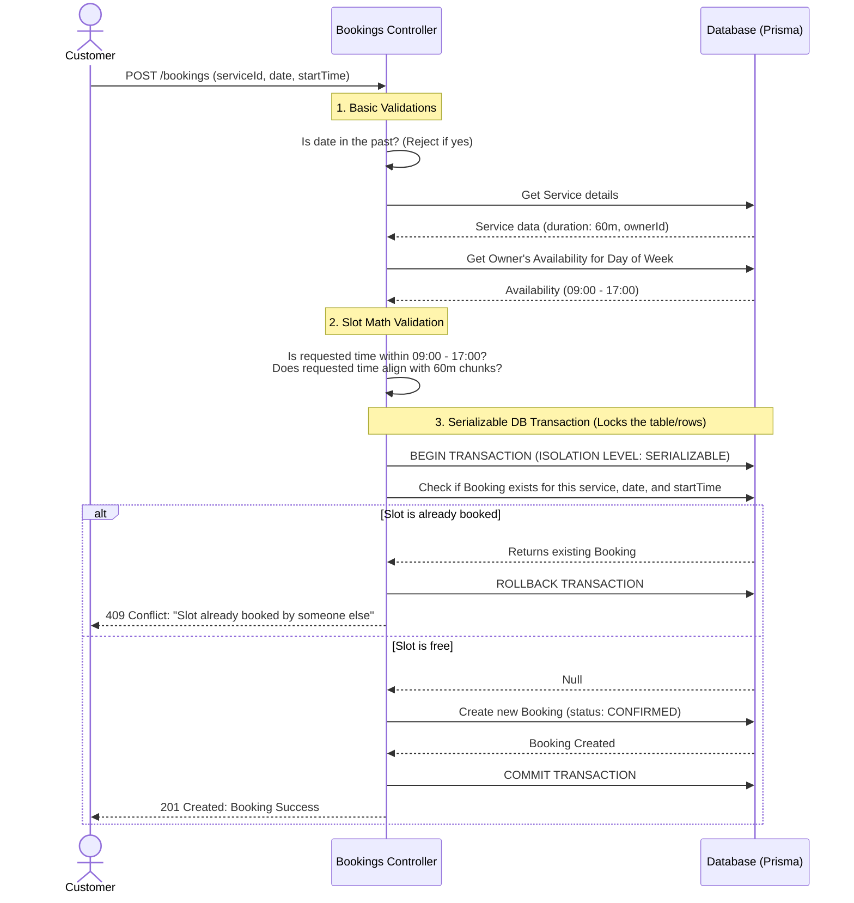

# BookSlot Booking Logic Explanation

The booking system is designed to be highly dynamic and robust against concurrent access (like two people trying to book the exact same slot at the exact same millisecond). 

Here is a breakdown of how the core booking logic works.

## 1. Dynamic Slot Generation (No Pre-saved Slots)

One of the most important architectural decisions is that **we do not store empty slots in the database**. 

Instead of generating and saving thousands of rows like "Slot 9:00", "Slot 9:30" into the database for every day of the year, we compute availability on the fly when the user asks for it (`GET /bookings/slots`).

When a customer wants to see available slots for a "Haircut" on next Monday, the system:
1. Finds out what day of the week the date is (e.g., `MONDAY`).
2. Fetches the business owner's generic weekly schedule for `MONDAY` (e.g., Open 09:00 to 17:00).
3. Fetches the `durationMin` of the Haircut service (e.g., 60 minutes).
4. Slices the time between 09:00 and 17:00 into 60-minute blocks (09:00, 10:00, 11:00...).
5. Queries the database for **only the active bookings** that already exist on that specific date.
6. Filters out the times that are already booked and returns the remaining times to the user.

If the owner changes their hours tomorrow, or changes the duration of a haircut, the system automatically adapts without needing to update thousands of future slot rows in the database.

## 2. The Booking Process & Double-Booking Prevention

When a customer actually clicks "Book", the backend performs strict validations and uses database-level concurrency controls to ensure fairness.

Here is the flow when a user attempts to book a slot:

### Why a `Serializable` Transaction?

The most critical part of the diagram above is the **Serializable Transaction**. 

In high-traffic systems, Customer A and Customer B might click "Book 10:00 AM" at the exact same millisecond. 
- Customer A's request checks the database: "Is 10:00 AM free?" DB says "Yes".
- Customer B's request checks the database a microsecond later: "Is 10:00 AM free?" DB says "Yes" (because A hasn't actually created the booking row yet).
- Both requests proceed to create a booking, resulting in a **double-booking**.

By wrapping the check and the creation in a transaction with `Prisma.TransactionIsolationLevel.Serializable`, the database ensures that if Customer A is checking that slot, Customer B has to wait in line. If Customer A succeeds, when Customer B is finally allowed to check, the database will correctly tell Customer B that the slot is now taken, triggering the `409 ConflictException`.
